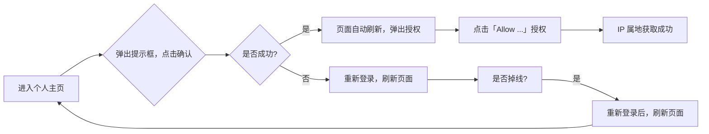

# BiliSpaceIPLocator

在哔哩哔哩主页显示 IP 属地。仅支持显示个人主页。为了获得完整体验，建议配合使用[哔哩哔哩网页版显示 IP 属地](https://greasyfork.org/scripts/466815)脚本。

## 使用说明

1. 目前脚本仅支持在个人主页显示 IP 属地信息，**使用时请确保已保持登录状态**。
2. 由于 Manifest V3 的限制，部分浏览器可能需要启用[开发者模式](https://www.tampermonkey.net/faq.php?locale=zh#Q209)才能正常运行脚本。
   - **暂时不兼容 Safari**。
3. 部分用户本身不存在 IP 属地信息，这种情况下页面不会显示任何属地信息。
4. 脚本通过手机客户端 API 进行点赞操作，需要获取 `access_key`。
   - 在首次访问个人主页时，页面会弹出提示框请求获取 `access_key`。
   - 获取成功后该信息会保存在脚本储存中，后续访问时无需重复获取。
   - 由于进行了跨源请求，你需要**允许**脚本请求对应接口。

## 安装教程

1. 安装并启用此脚本。
2. 进入任意用户的主页，页面会弹出提示框询问是否获取 `access_key`。
3. 点击确认按钮
   - 由于未知原因，首次获取时可能会导致账号掉线。
   - 此时页面会自动刷新，请重新登录并刷新页面，再次按照提示获取。
4. 获取 `access_key` 后，页面会自动刷新，如果你使用 Tampermonkey 此时会弹出授权提示，请按需点击「Allow ...」（推荐 Always）：
   

      
   

6. 用户名旁会显示 IP 属地信息：
   

      
   

7. 若需要重新获取 `access_key`，请点击脚本菜单中的按钮进行操作：
   

      
   

### 安装流程图  

## 感谢

- [lzghzr](https://github.com/lzghzr) 的 [libBilibiliToken](https://github.com/lzghzr/TampermonkeyJS/blob/master/libBilibiliToken/libBilibiliToken.ts) - 简化了获取 `access_key`的过程。
- [Bilibili 哔哩哔哩视频点踩](https://greasyfork.org/scripts/487644) - 参考了部分代码。
